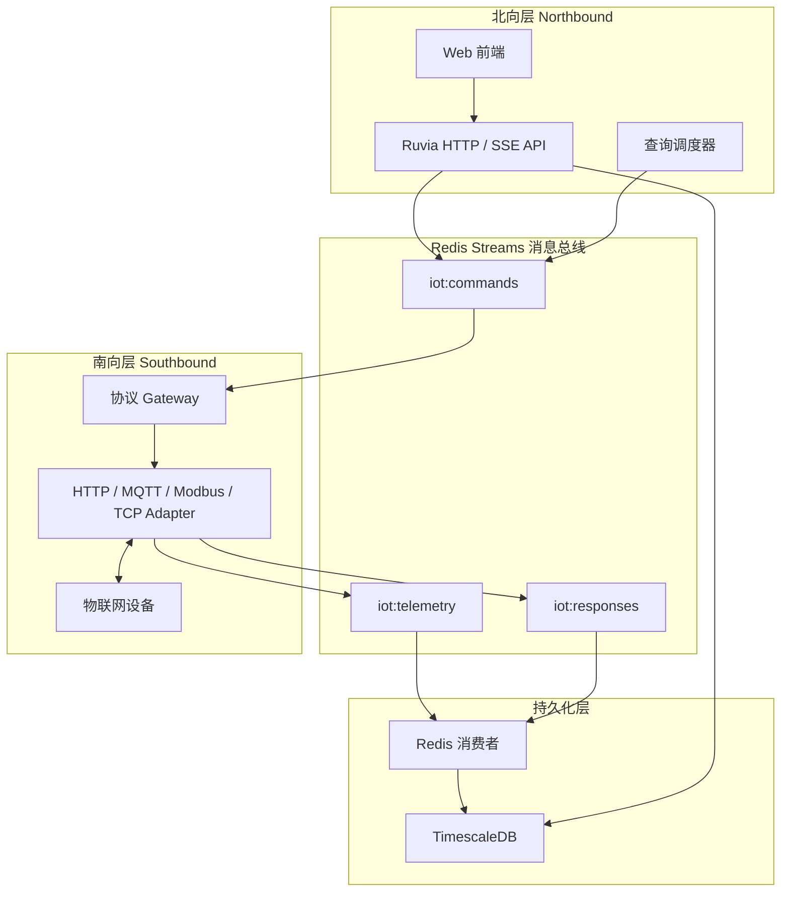
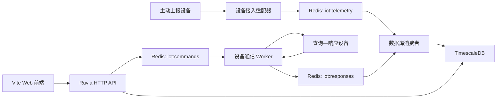

# 总体架构

## 目标

系统同时支持主动上报设备和查询—响应设备，并为前端提供设备管理、实时状态、
历史趋势、命令执行和队列监控能力。

本项目是 `iot-manager` 的重写。业务能力和协议语义参考旧项目，框架、消息边界和
数据写入链路按本文档重新设计。详细映射见
[iot-manager 参考基线](iot-manager-reference.md)。

开发环境由 `web/` 中的 Vite 和 `service/` 中的 Ruvia 分别提供前端与 API；生产环境由单个 Ruvia 后端进程
提供 API、静态前端、队列消费和设备通信能力。

## 南北向逻辑分离

系统在逻辑上划分为北向层、消息总线、南向层和持久化层。它们可以编译进同一个
进程，但必须通过明确的模块接口隔离。



### 北向层职责

- 为前端和第三方系统提供 HTTP、SSE 等 Web API；
- 管理设备元数据和查询任务；
- 把设备命令写入 `iot:commands`；
- 从 TimescaleDB 查询已经持久化的数据；
- 不直接调用设备协议适配器。

### 南向层职责

- 管理设备连接和协议细节；
- 从 `iot:commands` 消费查询命令；
- 把主动上报写入 `iot:telemetry`；
- 把查询结果、错误和超时写入 `iot:responses`；
- 不直接调用北向 Controller；
- 不直接写 TimescaleDB。

### 强制边界

南北向之间的跨层通信只允许使用 Redis Streams：

```text
北向 -> 南向：iot:commands
南向 -> 北向/持久化：iot:telemetry、iot:responses
```

禁止添加北向到南向的进程内函数调用、共享任务队列或绕过 Redis 的快速路径。
即使两层运行在同一个进程中，也必须遵守该边界，以便未来在不修改消息协议的
情况下拆分为独立服务。



## 单进程组件

生产环境的 `iot-engine` 进程包含：

- Ruvia HTTP worker；
- 前端静态文件服务；
- Redis 遥测生产者；
- Redis 查询命令生产者；
- 设备协议适配器；
- 遥测和响应消费者；
- Pending 消息回收与死信处理；
- TimescaleDB 查询和写入组件；
- 查询响应关联与超时管理。

单进程不等于单线程。每个后台组件使用明确的生命周期和独立连接，不能跨线程
持有 Ruvia 请求作用域中的 `Context`、Redis handle 或 DB handle。

## 数据流约束

### 主动上报

```text
设备 -> 接入 API/适配器 -> XADD iot:telemetry
     -> XREADGROUP -> TimescaleDB 事务 -> XACK
```

### 查询—响应

```text
Web/API/调度器 -> XADD iot:commands
               -> 设备协议适配器 -> 设备
               -> XADD iot:responses
               -> XREADGROUP -> TimescaleDB 事务 -> XACK
```

任何设备数据都不能绕过 Redis 直接写入 TimescaleDB。

## 交付语义

- 使用 Redis Consumer Group；
- 提供至少一次投递；
- 使用事件 ID、命令 ID 和数据库唯一约束保证幂等；
- 数据库提交后才执行 `XACK`；
- 消费失败的消息留在 Pending Entries List；
- 使用 `XAUTOCLAIM` 回收超时 Pending 消息；
- 超过重试上限后转入 Dead Letter Stream。
