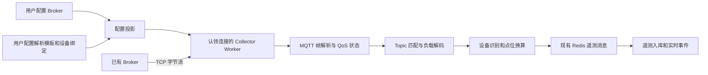

# MQTT 接入与用户配置

平台作为 MQTT 3.1.1 Client 连接已有 Broker。MQTT 帧编解码、订阅、QoS 握手和保活由项目自行实现，复用 Collector 的 TCP 传输、连接认领、配置投影和遥测流水线。

报文与会话规则参照 [OASIS MQTT 3.1.1 标准](https://www.oasis-open.org/standard/mqttv3-1-1/)。



连接、解析状态、计时器和异步网络结果属于认领连接的原 Worker。管理模块与 Collector 通过数据库和 Redis 交互。协议解析不执行网络或数据库 I/O。

## 配置步骤

1. 在 **MQTT 配置** 页面新增设备类型，按 **属性 → Topic → 上报消息 → 控制消息** 四个 Tab 配置。先定义属性名称、类型与单位，再在 Topic 和消息中插入属性；每种控制消息独立设置名称、Topic、模板和必填控制点。QoS、存储策略和时间格式位于 Topic 页。“上报解析测试”位于上报消息页，使用服务端同一套无 I/O 解码函数，不保存配置、不连接 Broker、不下发控制消息。
2. 在链路页面选择 `MQTT`、`TCP Client`，添加 Broker 地址、端口、Client ID、用户名、密码和保活间隔。地址支持 IPv4、IPv6、域名；每条同时工作的连接须使用 Broker 内唯一的 Client ID。
3. 创建设备，选择该链路、Broker 目标和解析模板，填写设备编码。编码须与 Topic 或消息中提取的值一致。相同 Broker 目标内设备编码唯一。
4. 启用链路和设备。配置变更后连接重新建立并订阅；Broker 断线沿用 TCP Client 的有界重连机制。

### 页面消息模板

页面只使用 JSON 占位符配置，不再逐项填写字段路径、设备识别模式、文本列号或二进制位置。保存后左侧显示设备类型、点位数及启用状态，右侧显示点位名称、标识、消息路径、类型、单位及读写状态。点击点位“编辑”进入属性页并展开该点位。

例如上报 Topic 为 `devices/{deviceCode}/telemetry`：

```json
{
  "deviceId": "$deviceCode",
  "timestamp": "$time",
  "data": {
    "temperature": "$point:温度",
    "humidity": "$point:湿度",
    "online": "$point:在线"
  }
}
```

- `"$point:名称"` 引用属性页中已定义的属性，所在位置自动转换为 JSON Pointer；名称必须唯一。新增属性默认数值类型，布尔或文本属性须选择对应类型；模板中的未知名称不会自动创建属性。
- `"$deviceCode"` 标记消息中的设备编码。Topic 含 `{deviceCode}` 时按设备绑定；共享或通配 Topic 则通过消息中的编码识别设备。Topic 中的 `{deviceCode}` 必须独占一层且只出现一次。
- `"$time"` 标记设备时间；省略时使用接收时间。时间格式在 Topic 页选择。
- 占位符必须是完整的 JSON 字符串值，不替换键名，不做字符串拼接或表达式计算。未标记字段不采集，模板不要求列出实际消息的全部字段。
- 上报模板为单记录 JSON 对象，支持嵌套对象和固定数组位置；最多 256 个点位、32 层、16384 UTF-8 字节。重复键、重复上报占位符、未知占位符会被拒绝。

控制 Topic 例如 `devices/{deviceCode}/command`，控制模板同样使用点位名称：

```json
{
  "action": "set",
  "deviceId": "$deviceCode",
  "set": {
    "targetTemperature": "$point:温度",
    "online": "$point:在线"
  }
}
```

控制模板引用属性页中已定义的属性，可以引用未参与上报的属性。任一控制消息引用的属性自动标为可写；上报路径和控制路径可以不同。每条消息选择自身的必填控制点，下发缺少必填值时整条消息拒绝发送。选填的 `online` 留空时省略对应 JSON 字段，不补零、不填 null，也不发送未替换的占位符；显式填写 `0` 或 `false` 不会被当成缺失。下发温度 `25.6` 时输出 JSON 数字；布尔和文本保持对应类型，倍率与枚举按现有规则逆转换。

控制 Topic 支持 `{deviceCode}` 和 `{point:属性名称}`，占位符须独占一层，属性值不得包含 `/`、`+`、`#`。订阅 Topic 不能引用尚未接收的属性值。控制 Topic 和固定数组直接引用的属性必须设为必填，避免空 Topic 或数组位置变化。

属性保留 UUID，修改模板只调整映射与可写状态，不隐式新增、改名或删除属性；属性改名后须同步修改引用。倍率、偏移、枚举在属性展开行中设置。删除全部控制消息后保存会清空旧模板与旧 Topic，避免浅合并残留。上报和控制模板均提供“格式化 JSON”，保留数字原文、字符串转义和占位符；JSON 无效时提示错误并保留原文。编辑期间修改模板或测试输入会作废旧解析结果。

### 设备管理

- 设备继续绑定 MQTT 链路、Broker 目标和设备类型；设备卡片按统一点位样式展示名称、数值和单位，上报变化经页面现有 SSE 更新。
- 下发入口按消息名称提供选择，只列出所选消息 Topic 和模板引用的属性，并标明必填或选填，不要求再次填写 Topic 或 JSON。数值、布尔、文本沿用统一输入控件；布尔输入 `0` / `1` 后按 JSON 布尔值发送。
- 填写后点击“下发”，本次填写组成一条 MQTT 消息和一个命令记录；选填留空则省略。布尔预设按钮仅填值，须统一提交并通过全部必填校验后发送。

### 既有配置

HTTP 与存储保留原有字段映射，`reportTemplate` 用于准确回显上报模板。新增可选 `commands` 数组，最多 32 条，每条包含 `id`（UUID）、`name`、`topic`、`template` 和 `requiredPointIds`。控制专用属性的 `field` 为空。没有修改历史迁移或设备绑定。

既有 `commandTopic` / `commandTemplate` 配置及不传消息 ID 的下发方式继续生效；可无歧义还原的单条 JSON 控制配置在页面编辑保存时转成一条具名消息，保留属性 UUID，并清空旧字段。新旧控制配置不得同时非空。使用 `commands` 的配置下发时必须提供所选 `mqttMessageId`，设备详情的 `commandOperations` 返回该 ID 和每个属性的 `required`；幂等比较包含消息 ID，复用同一幂等键下发其他消息会被拒绝。外部调用者应先读取设备操作列表，再切换新配置。

文本、二进制、批量记录路径、旧 `$values` 控制模板等无法通过页面无损表达的配置会明确提示不能编辑，不自动覆盖；其既有 API 与运行协议仍保留。测试覆盖旧单消息运行、旧 JSON 配置回显、新消息保存往返及 Redis 指令中消息选择的传递。

## Topic 与设备识别

| 场景 | 配置 |
| --- | --- |
| 一个 Topic 对应一个设备 | `topic: "devices/{deviceCode}/telemetry"`，`identitySource: "bound"` |
| 多个设备共享 Topic，编码在负载中 | `topic: "factory/telemetry"`，`identitySource: "payload"`，填写 `deviceCodeField` |
| 多个设备使用通配 Topic，编码在 Topic 中 | `topic: "devices/+/telemetry"`，`identitySource: "topic"`，`topicDeviceSegment: 1` |

Topic 层号、文本列号、二进制偏移均从 `0` 开始。`+` 独占一层；`#` 独占最后一层。通配 Topic 必须从 Topic 或负载识别设备。`{deviceCode}` 在订阅和指令 Topic 中替换为绑定设备编码。

未知设备编码不自动创建设备，消息不会归给另一台设备。同一消息可包含多条设备记录，分别产生具有独立幂等身份的遥测消息。

## 底层负载格式与既有 API

### JSON

支持单对象、顶层数组和嵌套数组。裸字段名读取顶层键；以 `/` 开头的路径使用 JSON Pointer，`~1` 表示 `/`，`~0` 表示 `~`，数字路径段可读取数组元素。`recordsPath` 先选中记录对象或数组，设备、点位和时间路径均相对每条记录。

例如 Broker 发布：

```json
{"devices":[{"code":"D001","metrics":{"temperature":256},"time":1790740800123},{"code":"D002","metrics":{"temperature":281},"time":1790740800123}]}
```

解析模板：

```json
{
  "storagePolicy": "report",
  "topic": "factory/telemetry",
  "qos": 1,
  "payloadFormat": "json",
  "recordsPath": "/devices",
  "identitySource": "payload",
  "deviceCodeField": "/code",
  "timeField": "/time",
  "timeFormat": "unix_ms",
  "commandTopic": "factory/commands",
  "commandTemplate": "{\"cmd\":\"set\",\"device\":\"$deviceCode\",\"set\":{\"temperature\":\"$point:温度\"}}",
  "points": [{
    "id": "00000000-0000-7000-8000-000000000001",
    "name": "温度",
    "field": "/metrics/temperature",
    "dataType": "DOUBLE",
    "unit": "℃",
    "scale": 0.1,
    "writable": true
  }]
}
```

其中 D001 的温度为 `25.6`，D002 为 `28.1`。点位 ID 为 UUID；名称、字段和 ID 等约束由保存接口和预览接口校验。

### 分隔文本

选择 `payloadFormat: "text"`，填写 `delimiter` 和 `recordDelimiter`。设备、点位和时间字段填写列号。例如 `D001,256;D002,281`，字段分隔符为 `,`、记录分隔符为 `;`，设备标识列为 `0`、温度列为 `1`。分隔符按字面值匹配，不解析 CSV 引号或转义语法。

### 定长二进制

选择 `payloadFormat: "binary"`；`recordLength` 大于零时按定长切分，`0` 时整条负载是一条记录。字段格式为 `偏移:长度:编码[:字节序]`：

| 编码 | 长度与行为 |
| --- | --- |
| `UINT`、`INT` | 1、2、4 字节，无符号或有符号整数 |
| `FLOAT` | 4、8 字节浮点数；拒绝非有限数值 |
| `UTF8` | 固定字节长度，读到第一个 NUL，写入后补零 |
| `HEX` | 固定字节长度，输出大写 HEX 字符串 |

`BE` 为默认大端，`LE` 为小端。例如 `0:4:UTF8` 是设备编码，`4:2:UINT:LE` 是温度原值，记录长度为 `6`。预览输入 HEX；Broker 实际发送原始字节。

当前支持上述可配置解码方式；任意专有压缩、加密、变长结构或脚本执行需要单独的解码能力。

## 点位、时间与指令

点位支持 `BOOL`、`STRING`、`DOUBLE`。枚举先将 `input` 映射为 `output`，数值再应用 `原值 × scale + offset`。可写点位下发时执行逆换算和枚举反向映射。可写数值点位的倍率不能为零，枚举转换值须唯一。

时间支持 `unix_ms`、`unix_s`、`iso8601`。无时区的 ISO 时间按设备 `timezone` 解释，数据库保存 UTC。时间字段缺失使用接收时间；显式提供但无效的时间导致跳过该记录。缺失或无法转换的点位不发布；预览列出相应诊断。

指令需要点位可写、设备允许远程控制以及具体控制 Topic。新配置还须选择消息并满足该消息的必填约束。页面使用完整字符串值 `"$point:名称"` 和 `"$deviceCode"`，分别替换为本次请求点位的转换后原始值与设备编码；未知点位、不可写点位及请求点位未被当前消息引用均拒绝发送。只替换值，不替换 JSON 键名。

既有 API 未指定模板时仍按点位路径组织对象，并在负载身份模式加入设备编码；历史 `"$values"` 模板仍替换为该对象，但新页面不提供该写法。文本按列号编码，二进制按字段偏移编码。指令使用至少 QoS 1。

收到 Broker 的 PUBACK 或完成 QoS 2 握手后，指令记录为 `mqtt_broker_acknowledged`，页面提示“控制消息已送达 Broker；设备执行结果需等待设备回执”，不将 Broker 确认显示为设备执行成功。设备执行结果需要设备专用的上行回执协议。

## 运行范围与交付语义

- 当前为普通 TCP、MQTT 3.1.1、Clean Session；不提供 TLS、MQTT 5、持久会话或离线订阅恢复。Broker 须允许当前连接方式。
- 支持上行 QoS 0/1/2、下行 QoS 1/2、断包与粘包、保活、响应超时和重连订阅。
- QoS 1 的 PUBACK、QoS 2 的 PUBCOMP 等待本批有效遥测成功发布到既有持久 Redis 流水线。数据库由后续消费者写入。QoS 2 的 PUBREC 表示当前连接已接收负载；进程退出或 Clean Session 重连不承诺恢复该内存状态。
- 无匹配设备、无有效点位或业务负载无效的消息跳过并完成握手；协议帧非法会关闭连接。解析失败可用配置预览及现有报文调试排查。
- 单帧剩余长度最多 1 MiB；单消息最多 256 条记录；模板最多 256 点位；在途报文最多 256，待处理接收帧累计最多 16 MiB。超过限制会拒绝处理。
- MQTT 只接入平台 Collector，不增加 EdgeNode 固件协议，不改变已部署固件契约。

## Ruvia 与验证

Ruvia 固定为 `e4058c9573d8021d0694a79aebae41883fa4760d`。升级配套引入该提交的 OpenSSL 3.6.4 overlay，来源和许可证见 `ports/vcpkg/openssl/README.md`。HTTP 二进制响应读取迁移到公开的 `bytes()`。

新增后端测试 `mqtt-protocol`、`mqtt-transport`、`mqtt-configuration`，覆盖帧、QoS、设备路由、配置、预览、三种负载格式、指令编码、真实 TCP Broker、重连、域名和连接归属。

在独立本地 PostgreSQL/TimescaleDB、Redis 和 API 实例中运行 `tests/mqtt-integration.ts`，验证管理接口、预览鉴权、两设备共享 Topic、批量遥测、设备时间、数值换算、多点模板合并为一条消息与一个命令记录，以及 Broker 确认。连接参数使用现有 `architecture-fixture.ts` 的本地环境变量契约。

设备管理浏览器验证覆盖绑定回显与保存、实时点位更新、只读点位不进入控制表单、数字/布尔/文本同消息下发，以及 Broker 确认提示；使用真实 API、Collector、MQTT TCP 连接、PostgreSQL/TimescaleDB 和 Redis，不以接口模拟响应代替。

`tests/mqtt-migration-integration.ts` 按既有迁移测试约定运行各阶段，验证 `0052_mqtt_client` 的新库、重启、旧库升级、重复执行、漂移拒绝和失败回滚。仅用于已停止业务进程的可丢弃本地数据库。
